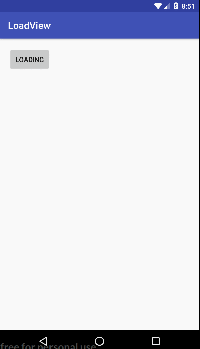

# LoadingView
耗时请求加载框。。。




### 技巧点：

* progressbar 更改颜色在xml中添加两句代码

```
android:indeterminateTint="#7f7f7f"
android:indeterminateTintMode="src_atop"
```

* dialog自定义contentView。LoadingDialog类是Dialog的包装类，一不小心好像用了一种设计模式，好像是装饰者模式，嘎嘎嘎。

  ```
  /**
   * 配置是否能返回键取消加载框
   *
   * @param flag
   */
  public void setCancelable(boolean flag)
  {
      dialog.setCancelable(flag);
  }

  /**
   * 配置是否能点击框外取消加载框
   *
   * @param cancel
   */
  public void setCanceledOnTouchOutside(boolean cancel)
  {
      dialog.setCanceledOnTouchOutside(cancel);
  }

  /**
   * 显示
   */
  public void show()
  {
      loadView.startLoading();
      dialog.show();
  }

  /**
   * 消失
   */
  public void dismiss()
  {
      loadView.stopLoading();
      dialog.dismiss();
  }
  ```

* 自定义GraduallyTextView实现加载文字跟着high起来的幻觉。借鉴的http://www.jianshu.com/p/f8a9cfb729f9

  主要是利用了drawText和透明度这两个技术点。

