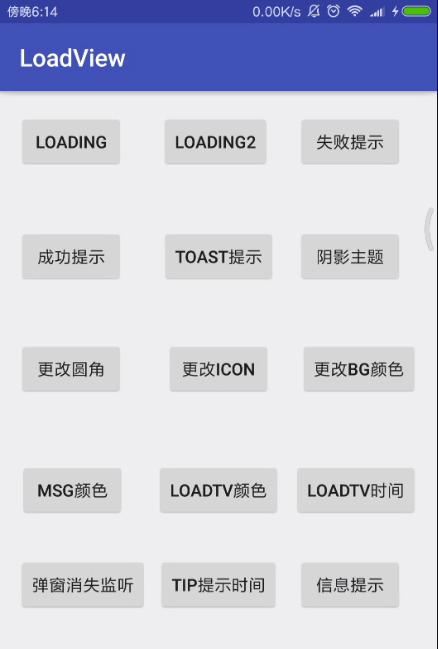
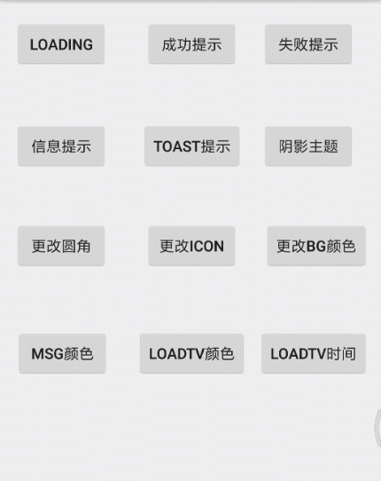
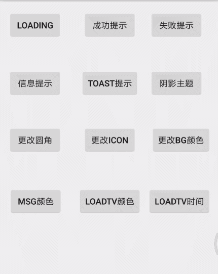
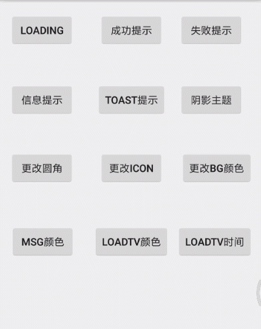

# LoadingView
耗时加载框和提示框。

### **图片展示：**




### **展示1：耗时加载框**




**代码：**

```
tipLoadDialog = new TipLoadDialog(this);
//默认是无阴影主题
tipLoadDialog.setMsgAndType(LOADING_玩命, TipLoadDialog.ICON_TYPE_LOADING).show();
```


### **展示2：tip提示框 1s后自动消失**


**代码：**

```
//设置无阴影主题
tipLoadDialog.setNoShadowTheme().setMsgAndType(sucTip, TipLoadDialog.ICON_TYPE_SUCCESS).show();
```


### 展示3：阴影主题


**代码:**

```
//设置提示框阴影主题
tipLoadDialog.setShadowTheme().setMsgAndType(sucTip, TipLoadDialog.ICON_TYPE_SUCCESS).show();
```


### 展示4：设置圆角


**代码：**

```
//设置圆角
tipLoadDialog.setBackground(R.drawable.custom_dialog_bg_corner)
        .setNoShadowTheme()
        .setMsgAndType(LOADING_玩命, TipLoadDialog.ICON_TYPE_LOADING)
        .show();
```


### 展示5：设置icon



**代码：**

```
//设置除了Loading之外的tip图标
tipLoadDialog.setSuccessIcon(R.mipmap.custom_tip)
        .setMsgAndType(sucTip, TipLoadDialog.ICON_TYPE_SUCCESS)
        .show();
```


### 展示6：设置背景颜色


**代码：**

```
//设置背景颜色
tipLoadDialog.setBackground(R.drawable.custom_dialog_bg_color)
        .setNoShadowTheme()
        .setMsgAndType(sucTip, TipLoadDialog.ICON_TYPE_SUCCESS)
        .show();
```


### 展示7：设置提示文字颜色和大小


**代码：**

```
//设置提示信息的text的颜色和大小
tipLoadDialog.setNoShadowTheme()
        .setMsgColor(Color.BLUE)
        .setMsgSize(20)
        .setMsgAndType(failTip, TipLoadDialog.ICON_TYPE_FAIL)
        .show();
```


### 展示8：设置加载框文字颜色和大小，以及progressbar颜色




**代码：**

```
//设置加载框文字的颜色和大小 以及progressbar的颜色
tipLoadDialog.setNoShadowTheme()
        .setProgressbarColor(Color.RED)
        .setLoadingTextColor(Color.RED)
        .setLoadingTextSize(20)
        .setMsgAndType(LOADING_玩命, TipLoadDialog.ICON_TYPE_LOADING)
        .show();
```


### 展示9：设置加载一次文字动画时间


**代码：**

```
//设置loadingText一次动画的时间
tipLoadDialog.setNoShadowTheme()
        .setProgressbarColor(Color.WHITE)
        .setLoadingTextColor(Color.WHITE)
        .setLoadingTextSize(15)
        .setLoadingTime(10000)
        .setMsgAndType(LOADING_玩命, TipLoadDialog.ICON_TYPE_LOADING)
        .show();
```


### 两种实现模式：

一、采用Dialog模式实现：

缺点：必须得依赖Activity页面，所以很难用单例模式来生成，因为会造成内存泄漏。

优点：dialog本来就是为这个而生的，比较简单。


二、采用Toast模式实现：

缺点：无法像dialog一样能获取焦点，屏蔽其他控件事件。(比如正在加载网络请求时，页面其他控件是不能点击 

​            的，但是toast无法屏蔽事件)

优点：不依赖Activity，只需要Application即可。


duration时间问题。因为toast时间系统设置为固定的2秒和3.5秒。

使用toast需要解决两个问题：

①当duration不是2或者3.5秒时，怎么解决；

②当duration不确定时，怎么解决，比如正在进行网络请求；

**解决方案：主要是利用了CountDownTimer类。Android自带的倒计时控件。**


